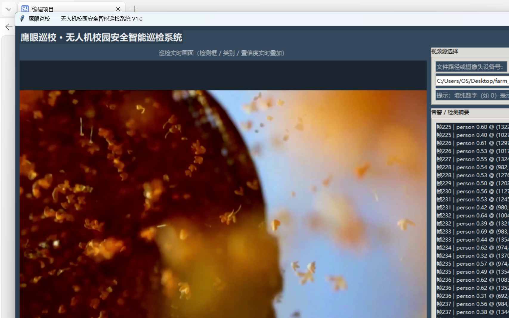

# 鹰眼巡校——无人机校园安全智能巡检系统 V1.0 操作手册

## 1 软件简介

"鹰眼巡校——无人机校园安全智能巡检系统 V1.0"（以下简称"鹰眼巡校"）是一款面向校园安防场景的无人机巡检视频智能分析桌面软件。系统以 YOLOv8 深度学习目标检测模型为核心，对无人机航拍/巡航画面中的人、汽车、自行车等目标进行实时检测，并在此基础上提供分区域差异化阈值过滤、多帧确认降噪、ByteTrack 多目标跟踪、越线方向计数、徘徊检测告警、告警截图归档、人流车流热力图、切片推理增强与推理加速等功能，配套完整的模型训练管线与多高度测试评估工具。

系统主要特点：

- 实时检测显示：视频逐帧播放，检测框、类别、置信度实时叠加渲染；
- 智能降噪：多帧 IOU 确认与 ByteTrack 跟踪双路径，瞬时误检不进入告警；
- 事件检测：虚拟警戒线双向越线计数、区域停留超时徘徊告警；
- 证据留存：告警自动截图归档并记录 CSV 日志，可逐条追溯；
- 态势分析：人流车流热力图导出，辅助校园重点区域规划；
- 高空增强：自研切片推理提升俯视小目标召回，FP16 半精度与跳帧外推加速；
- 全流程工具：数据采集标注规范、COCO→YOLO 格式转换、迁移学习训练、分高度评估一体化。

本手册面向系统操作人员与部署维护人员，介绍软件的运行环境、安装部署方法、各功能的操作步骤与配置项，并附常见问题解答。

## 2 运行环境

### 2.1 实测开发与联调环境

本手册全部操作截图与数据均来自以下真实联调环境：

| 项目 | 实测配置 |
|---|---|
| 操作系统 | Windows 10/11 64 位 |
| Python 版本 | Python 3.14.2（兼容 Python 3.10 及以上） |
| 深度学习框架 | torch 2.12.1+cu126，ultralytics 8.4.21 |
| 图像处理 | opencv-python 4.13.0，numpy 2.4.1，Pillow 12.2.0 |
| 图形界面 | tkinter（Python 标准库自带，无需单独安装） |
| GPU（可选） | NVIDIA GeForce RTX 3060 Laptop GPU（CUDA 可用，FP16 半精度推理实际生效） |

### 2.2 无独立显卡环境的降级运行

系统不强制要求 NVIDIA 显卡：配置项 `fp16` 开启但检测不到 CUDA GPU 时，检测引擎自动降级为 FP32 全精度推理并在启动日志中说明，全部功能仍可正常使用，仅推理速度下降。纯 CPU 环境下建议使用跳帧检测加速（见 5.3 节与 5.10 节）弥补帧率。

## 3 安装部署

### 3.1 获取与目录结构

将软件源码目录 `eagle_eye_patrol/` 完整复制到目标机器，主要目录如下：

```text
eagle_eye_patrol/
├── src/         # 系统源代码（GUI 入口 app.py 与各功能模块）
├── tools/       # 训练/评估/基准/导出等配套工具脚本
├── weights/     # 模型权重目录（yolov8n.pt 等）
├── data/        # 数据集配置（campus.yaml 模板）
├── tests/       # 测试脚本与测试产物
├── docs/        # 操作手册、测试报告、性能测试报告
├── archive/     # 运行期告警归档输出（截图与 CSV 日志）
├── logs/        # 运行日志输出
└── requirements.txt  # Python 依赖清单
```

### 3.2 安装 Python 依赖

在项目根目录下执行：

```bash
pip install -r requirements.txt
```

依赖清单共 4 项：`ultralytics>=8.4`（YOLO 检测与跟踪）、`opencv-python>=4.8`（视频解码与画面标注）、`numpy>=1.24`（数值计算）、`Pillow>=10.0`（GUI 画面显示与归档截图）。

### 3.3 模型权重准备

系统默认权重路径为配置项 `weights_path = "weights/yolov8n.pt"`（COCO 预训练权重，默认可检测 person/car/bicycle 等 80 类目标）。首次运行时若权重缺失，ultralytics 会自动联网下载；建议预先将 `yolov8n.pt` 放入 `weights/` 目录。使用自训校园权重时，把训练产出的 `best.pt` 放入 `weights/` 并将 `src/config.py` 中 `weights_path` 改为 `weights/best.pt`（见 5.9 节）。

### 3.4 跟踪依赖 lap 的首次联网安装事项

ByteTrack 跟踪器依赖的 `lap` 包是 ultralytics 的可选依赖，不随主包安装。**首次**使用跟踪功能（即首次执行 `model.track()`）时，ultralytics 会检测到 `lap` 缺失并自动调用包管理器联网安装，安装完成后当次进程内即生效。离线或网络受限环境务必提前手动安装：

```bash
pip install lap
```

### 3.5 启动系统

```bash
# 正常启动 GUI（启动后在界面中选择视频源）
python src/app.py

# 启动并直接加载指定视频文件
python src/app.py --video "C:/Users/OS/Desktop/farm_guard/videos/5G智慧农业素材.mp4"

# 摄像头实时巡检（填摄像头设备号）
python src/app.py --video 0
```

启动后窗口标题为"鹰眼巡校——无人机校园安全智能巡检系统 V1.0"，模型加载耗时数秒，状态栏提示"模型加载完成，就绪"后即可开始巡检。

## 4 快速上手与界面概览

系统主界面分为六个区域：顶部标题栏、左侧巡检实时画面区、画面下方"开始巡检/停止"按钮、右侧控制面板（视频源选择、功能开关、热力图操作、告警/检测摘要列表）与底部状态栏（运行状态与当前帧号）。



基本操作流程：

1. 在"视频源选择"区输入视频文件路径（或点"浏览…"选择文件；填纯数字如 0 表示摄像头设备号）；
2. 按需勾选"功能开关"区各功能（默认配置即可满足常规巡检）；
3. 点击"开始巡检"，视频逐帧播放并实时叠加检测结果，告警条目滚动显示在右侧列表；
4. 巡检中可随时点击"导出热力图"导出当前累积的人流车流分布；
5. 点击"停止"或视频播放结束后，告警截图与 CSV 日志已自动保存至 `archive/` 目录。

系统还提供两个自动化验收用命令行参数（不影响正常 GUI 操作）：

```bash
# 播放到第 60 帧后自动退出，退出前把带标注画面保存为图片
python src/app.py --video 测试视频路径 --max-frames 60 --dump-frame tests/a3_gui_frame.png
```

## 5 功能操作指南

### 5.1 实时检测显示

**功能说明**：巡检播放期间，系统对每一帧执行 YOLO 推理，把命中关注类别（默认 person/car/bicycle，配置项 `target_classes`）的目标以绿色矩形框叠加在画面上，框上方标注类别名与置信度（如 `car 0.35`，带底色条保证可读）。右侧"告警/检测摘要"列表逐帧滚动显示检测摘要（每行格式为 `帧号 | 类别 置信度 @ (中心x, 中心y)`，§4 主界面截图右侧列表即为真实运行条目），底部状态栏显示当前帧号。

**操作步骤**：

1. 启动系统并选择视频源，点击"开始巡检"；
2. 观察画面中的检测框与标签，右侧列表同步滚动；
3. 播放速度由配置项 `frame_interval_ms`（帧间隔毫秒数，默认 30）控制。

**注意事项**：画面上的叠加文字统一使用英文短词（如类别名、CENTER ZONE 等），因为 OpenCV 的 `cv2.putText` 仅支持 ASCII 字符，直接写中文会出现乱码方块；中文文案均由 tkinter 界面控件（按钮、列表、状态栏）呈现。


### 5.2 分区域差异化阈值

**功能说明**：无人机俯拍画面中，中央区域远处小目标较多、边缘区域畸变小目标较大，系统支持对两个区域施加不同的置信度阈值：中央区阈值 `center_conf_threshold`（默认 0.40，适当放低保召回），边缘区阈值 `edge_conf_threshold`（默认 0.50，略高抑制误检）。中央区范围由 `center_zone_ratio_w` / `center_zone_ratio_h`（默认均 0.5，居中对称）定义。目标归属按检测框底部中心锚点判定。

**操作步骤**：

1. 勾选功能开关"显示区域分界线（中央区/边缘区）"（默认开启，配置项 `show_zone_border`），画面叠加黄色 CENTER ZONE 分界线，左上角标注 EDGE ZONE；
2. 勾选"启用分区域置信度阈值过滤"（默认关闭），检测渲染接入分区过滤：保留目标按原样绘制并在标签追加区域标识（如 `car 0.35 [EDGE]`），被过滤目标绘为灰色框并标注 `filtered`；
3. 每次过滤判定均写入日志（含逐目标原因），可在 `logs/` 日志中追溯。


### 5.3 多帧确认与目标跟踪

**功能说明**：为压制单帧闪现的瞬时误检，系统默认开启多帧确认降噪——目标需连续 N 帧（`confirm_frames`，默认 3）稳定出现才标记为"已确认"（相邻帧按类别一致 + IOU≥`iou_threshold` 默认 0.30 匹配）。未确认目标绘为黄色虚线框并标注连续帧数进度（如 `car 0.31 confirm 2/3`），不进入告警列表与计数；已确认目标绘为绿色实线框并标注内部目标号（如 `#5`）。

在确认开关之上还可开启 ByteTrack 目标跟踪（复选框"启用 ByteTrack 目标跟踪（目标ID+轨迹尾迹）"，默认开启，配置项 `tracking_enabled`）：检测与确认改走 ultralytics `model.track()` 跟踪后端，目标带跨帧持久的跟踪 ID，画面叠加最近 30 帧（`track_tail_length`）的品红色轨迹尾迹。确认契约不变（轨迹累计存在满 N 帧才确认）；跟踪调用失败时自动降级为多帧 IOU 确认路径并记日志（后端标识 `iou-fallback`）。

**操作步骤**：

1. 确认"启用多帧确认降噪（未确认目标不告警）"已勾选（默认）；
2. 勾选"启用 ByteTrack 目标跟踪"，观察目标标签中的持久 ID 与轨迹尾迹；
3. 需要逐帧直显旧行为时，取消"启用多帧确认降噪"即可。


### 5.4 越线方向计数

**功能说明**：系统按配置项 `warning_line`（归一化坐标，默认 `(0.0, 0.5, 1.0, 0.5)` 即画面中部水平线）定义虚拟警戒线。已确认目标的底部中心锚点跨越警戒线时产生穿线事件并按方向累计计数：默认"下→上=进、上→下=出"（由 `line_enter_direction` 控制，False 则语义反转）。画面叠加青色 WARNING LINE、"IN"方向箭头与左上角 `IN: n OUT: n` 双向累计计数。锚点距线小于死区像素 `line_deadzone_px`（默认 3）时视为"压线"、所在侧维持不变，防止目标沿线抖动被反复计数；轨迹侧记忆超过 `line_track_max_age`（默认 30 帧）未出现则遗忘。

**操作步骤**：

1. 勾选"启用越线方向计数（警戒线+进出计数）"（默认开启，配置项 `line_count_enabled`）；
2. 观察画面警戒线与双向计数；穿线事件写入告警列表（每行格式为 `帧号 | 视频内时间 | 越线方向 | 类别 #轨迹号 @ (穿越点) | 累计 进n 出n`；下方佐证帧所示真实事件为 帧1059、42.36s、越线出、person、累计 进0 出1，事件清单见 `tests/line_evidence/cross_events.json`）；
3. 越线计数依赖多帧确认提供的轨迹号：关闭多帧确认时越线计数自动跳过并记日志提示。

**事件佐证**：穿线事件可导出前后对照佐证帧——事件帧标注目标框、锚点与穿越点，对照帧标注同一轨迹号在事件前若干帧的位置，两帧对比可直接看出锚点位于警戒线两侧。


### 5.5 徘徊检测告警

**功能说明**：开启后画面叠加品红色 LOITER ZONE 徘徊监控区域（配置项 `loitering_zone`，归一化坐标，默认 `(0.25, 0.25, 0.75, 0.75)` 即画面中央一半区域）。已确认目标锚点连续停留在区域内时，目标旁实时标注停留时长 `#id STAY x.xs`；停留超过阈值 `loitering_duration_sec`（默认 5.0 秒）触发一次"徘徊告警"，停留标注转为告警红色，告警接入截图归档与告警列表（见 5.6 节）。目标离开区域后重新进入将重新计时。徘徊检测依赖多帧确认/跟踪提供的轨迹号，关闭多帧确认时自动跳过并记日志提示。

**操作步骤**：

1. 确认"启用多帧确认降噪"与"启用 ByteTrack 目标跟踪"已勾选；
2. 勾选"启用徘徊检测告警（区域内停留超时）"（默认开启，配置项 `loitering_enabled`）；
3. 观察品红区域内目标的 STAY 实时停留标注；告警触发后可在告警列表看到 `徘徊告警` 条目并在归档目录找到对应截图。


（上图为一次真实运行的告警帧：person #110 在区域内停留达阈值触发告警，`STAY 1.5s` 转为红色；演示运行时按场景把停留阈值配置为 1.5 秒，归档同步生成 `徘徊告警` 记录，见 5.6 节 CSV 示例第三行。）

### 5.6 告警截图归档与日志

**功能说明**：勾选"启用告警归档（告警截图+CSV日志）"（默认开启）后，三类告警在事件产生的当帧自动归档一次（不逐帧重复截图）：目标确认（已确认目标首次进入告警范围，且类别命中 `alert_classes`）、越线穿线事件、徘徊告警。归档内容包括：

- 告警截图：当前带标注画面（检测框、警戒线等已叠加完毕，与操作员所见一致）保存到归档目录 `archive_dir`（默认 `archive/`），文件名含毫秒时间戳与事件序号（如 `alert_20260912_150323_586_0001_confirm.png`），避免覆盖；
- 告警日志：`archive/alert_log.csv` 逐行追加，字段为 时间戳、事件类型、类别、置信度、位置、截图路径（UTF-8 带 BOM 编码，Excel 可直接打开不乱码；每行即时写盘，程序异常退出不丢记录）；
- 告警列表同步显示"已归档"条目（含截图文件名，便于按图追溯）。

关闭该开关时不截图、不写 CSV，告警列表行为回到上一功能状态。


告警日志 CSV 真实内容示例（截取自行运行产物）：

| 时间戳 | 事件类型 | 类别 | 置信度 | 位置 | 截图路径 |
|---|---|---|---|---|---|
| 2026-09-12 15:03:23.586 | 目标确认 | car | 0.34 | (819, 390) | archive\alert_20260912_150323_586_0001_confirm.png |
| 2026-09-12 15:03:23.960 | 目标确认 | car | 0.25 | (324, 658) | archive\alert_20260912_150323_960_0002_confirm.png |
| 2026-09-12 16:22:23.783 | 徘徊告警 | person | 0.34 | (1418, 766) | tests\b2_loiter_archive\alert_20260912_162223_783_0011_alert.png |

### 5.7 人流车流热力图

**功能说明**：巡检播放期间，系统持续累积已确认目标的底部中心锚点（未确认目标不计入），按高斯核累积渲染人流车流分布热力图。核半径 `heatmap_kernel_radius`（默认 25 像素）控制单个轨迹点影响范围，单点强度 `heatmap_intensity`（默认 1.0），叠加到底帧时的混合透明度 `heatmap_overlay_alpha`（默认 0.6，仅对热度大于 0 的像素生效）。

**操作步骤**：

1. 正常巡检一段时间（热力随巡检持续累积；多帧确认关闭时无已确认目标、热力不累积）；
2. 点击右侧"热力图"操作区的"导出热力图"按钮，当前累积渲染导出到 `archive/heatmap.png`：有当前画面时以带标注画面为底帧叠加导出，无画面时黑底导出；
3. 导出结果（路径与累积轨迹点数）显示在状态栏与告警列表；累积为空时导出失败并提示先运行巡检。


### 5.8 切片推理（高空小目标增强）

**功能说明**：高空俯拍画面中小目标像素占比低，整图推理容易漏检。切片推理把每帧切分为 2×2 重叠切片（`slice_rows`/`slice_cols` 默认 2），相邻切片重叠率 `slice_overlap_ratio`（默认 0.2，保证跨切片边界目标至少在某个切片中完整出现），逐片检测后把坐标映射回原图，再按 `slice_nms_iou`（默认 0.5）做类别感知合并 NMS 去重。切片相当于把局部画面放大推理，可提升小目标召回；代价是单帧耗时约为 4 片推理之和。

**操作步骤**：

1. 勾选"启用切片推理（2×2重叠切片+合并去重）"（默认关闭，配置项 `slice_enabled`）；
2. 检测路径即切换为切片管线，分区过滤、多帧确认等下游链路不变；
3. 注意互斥关系：跟踪后端 `model.track()` 内部为整图推理、无法注入切片检出结果，因此切片开启期间 ByteTrack 跟踪自动让位，多帧确认走 IOU 降级路径（启动日志有明确提示）；需要跟踪与徘徊检测时请关闭切片开关。


### 5.9 模型训练管线

**功能说明**：系统配套完整的训练管线，支持以 COCO 预训练权重为起点在校园巡检数据集上做迁移学习微调。整体流程为：数据采集（无人机航拍，覆盖 5/10/15 米高度档）→ 数据标注（LabelImg，YOLO 格式；宽或高小于 32 像素的极小目标正常标注但可在转换/评估环节按 32×32 标准筛除）→ 格式转换（COCO JSON 来源用 `tools/coco2yolo.py` 转为 YOLO 标注）→ 训练（`tools/train.py`）→ 评估（见 5.10 节）。详细规范见 `tools/README_TRAIN.md`。

**冒烟自验**（无真实数据集时验证流程，自动合成迷你数据集）：

```bash
python tools/train.py --data data/campus.yaml --epochs 1 --imgsz 320 --smoke
```

冒烟模式自动在 `data/smoke_dataset/` 下合成固定随机种子的彩色矩形目标与配套标注（train 8 张 / val 4 张），跑通"加载权重→训练→验证→保存权重"全流程。合成数据无可学习语义，精度数字无意义，不冒充真实训练结果。

**正式微调**：

```bash
python tools/train.py --data data/campus.yaml --epochs 100 --imgsz 960 --batch 8 --lr0 0.01
```

主要参数：`--weights`（预训练权重，默认取配置项 `weights_path`）、`--epochs`（默认 100）、`--imgsz`（默认 960；正式训练强制 ≥960，低于该值会被拒绝，保障俯视小目标召回）、`--batch`（默认 8）、`--lr0`/`--lrf`（初始学习率与最终系数）、`--hsv-h/--hsv-s/--hsv-v/--degrees/--translate/--scale/--fliplr/--mosaic`（数据增强）、`--device`、`--seed`（默认 42）。正式模式强制开启多尺度训练。

**训练产物**：`runs/<name>/` 目录下含训练曲线 `results.png`、混淆矩阵、逐轮指标 `results.csv` 与 `weights/best.pt`（按验证集 mAP 自动保存的最优权重）；正式训练结束后自动把 `best.pt` 复制为 `weights/best.pt`。确认效果达标后，把 `src/config.py` 的 `weights_path` 改为 `weights/best.pt`，系统主线即切换到自训模型。


### 5.10 系统测试与评估

**功能说明**：系统配套两类评估工具，全部数字来自真实运行输出并落盘存档。

**多高度检测评估**（`tools/evaluate.py`）：对测试视频统计检测成功率（轨迹确认率）、误检率（帧级/轨迹级）、漏检率（轨迹缺口率），支持按 5/10/15 米高度分组输入：

```bash
python tools/evaluate.py --config tests/eval_config.yaml
```

评估配置 `tests/eval_config.yaml` 按高度档位列出素材清单；评估结果 JSON 落盘（默认 `tests/a10_eval.json`），报告见 `docs/测试报告.md`。测试素材无人工标注真值时采用代理口径（候选轨迹中被稳定确认的比例等）；在配置中为视频指定 `gt_file`（CSV，表头 `frame,count`）后自动切换为真值比对口径。实测结果（15 米档高空混合素材，3712 帧）：检测成功率 0.8254、帧级误检率 0.0786、漏检率 0.1247，处理速度 37.49 FPS。

**推理加速基准**（`tools/benchmark.py`）：对同一视频分别运行优化前后两组管线，对比实测帧率与检出数：

```bash
python tools/benchmark.py --video "C:/Users/OS/Desktop/farm_guard/videos/5G智慧农业素材.mp4" --max-frames 300 --interval 3 --out tests/a13_benchmark.json
```

加速优化包含两项：FP16 半精度推理（配置项 `fp16`，默认开启，无 CUDA 自动降级 FP32）与跳帧检测（配置项 `detect_interval`，默认 1 不跳帧；GUI 复选框"启用跳帧检测加速（间隔走配置 detect_interval）"）。跳帧生效时每隔 N 帧执行一次检测+跟踪，中间帧由跟踪器按轨迹实测速度线性外推目标位置渲染（青色虚线框 + `extrap` 标注，确认计数只认实测帧）。实测（RTX 3060 Laptop）：优化前 40.79 FPS → 优化后 74.50 FPS（+82.6%），帧均检出数下降 9.5%，详见 `docs/性能测试.md`。


## 6 常见问题 FAQ

**Q1：Windows 控制台里的中文日志显示为乱码，是程序 bug 吗？**
不是。logging 的控制台输出跟随 Windows 控制台代码页（GBK），中文在控制台显示为乱码仅发生在显示层；`logs/` 目录下的日志文件按 UTF-8 写入，内容完整正常，以日志文件为准。需要控制台可读时，设 `PYTHONUTF8=1` 环境变量再运行即可。

**Q2：为什么视频画面上的叠加标注都是英文，不写中文？**
OpenCV 的 `cv2.putText` 只支持内置 Hershey 字体的 ASCII 字符集，直接写中文会输出乱码方块。因此画面标注统一用英文短词（如 CENTER ZONE、WARNING LINE、filtered、extrap）；中文文案全部放在 tkinter 界面控件（按钮、开关、列表、状态栏）上，不受影响。

**Q3：首次启用 ByteTrack 跟踪时程序卡住或提示安装 lap 包？**
`lap` 是 ultralytics 跟踪器的可选依赖，不随主包安装。首次执行跟踪时 ultralytics 会自动联网安装并提示"需重启才生效"（实测当次进程内即生效）。离线或受限网络环境请务必提前执行 `pip install lap`。

**Q4：为什么开启切片推理后，目标 ID 和轨迹尾迹不见了？**
这是设计上的显式互斥：跟踪后端 `model.track()` 内部自带整图推理，外部无法注入切片检出结果，两条检测路径不可叠加。切片开启期间 ByteTrack 跟踪自动让位，多帧确认走 IOU 降级路径（目标号为临时轨迹号），启动日志会写明让位关系。关闭切片开关即恢复跟踪。

**Q5：没有 NVIDIA 显卡的机器能运行吗？**
可以。配置 `fp16=True` 但检测不到 CUDA GPU 时，检测引擎自动降级为 FP32 全精度推理并记日志说明，配置值本身不被修改，全部功能可用，仅推理速度下降。CPU 环境建议开启跳帧检测加速（`detect_interval` 调大为 2~3）弥补帧率。

**Q6：巡检全程没有任何告警/检出，是检测失效吗？**
先排查类别语义：系统只告警 `target_classes`（默认 person/car/bicycle）命中的目标。例如弯腰劳作者在 COCO 预训练权重下可能被全部判为 sheep/cow 而被类别过滤，属正确行为而非失效。可用 `tools/demo_detect.py` 或评估脚本对抽样帧探测原始检出类别分布，区分"过滤后为空"与"推理失效"；校园场景建议接入自训权重（见 5.9 节）。

**Q7：正式训练时报错拒绝 imgsz 参数？**
正式训练强制输入尺寸 ≥960（俯视小目标召回要求），`--imgsz` 小于 960 会被拒绝；多尺度训练在正式模式强制开启。显存不足时请减小 `--batch`（正式训练 imgsz 不能再降）。流程性自验请用 `--smoke` 冒烟模式（该模式允许小 imgsz）。

**Q8：告警 CSV 用 Excel 打开乱码、归档截图在中文路径下丢失？**
已内置处理：CSV 按 UTF-8 带 BOM（utf-8-sig）编码写入，Excel 可直接识别；截图采用 `cv2.imencode` 编码后写文件的方式落盘，不受中文/非 ASCII 路径影响。若使用第三方工具另存/转码 CSV，请保持 UTF-8 编码。

## 7 附录：主要配置项速查

全部配置项集中于 `src/config.py` 的 `Config` 类，GUI 开关默认值均取自对应配置项：

| 配置项 | 默认值 | 说明 |
|---|---|---|
| weights_path | weights/yolov8n.pt | YOLO 模型权重路径 |
| video_source | "0" | 默认视频源（文件路径或摄像头编号） |
| imgsz | 640 | 推理输入图像尺寸 |
| target_classes | person/car/bicycle | 关注目标类别 |
| frame_interval_ms | 30 | GUI 播放帧间隔（毫秒） |
| center_zone_ratio_w/h | 0.5 / 0.5 | 中央区宽/高占画面比例 |
| center_conf_threshold | 0.40 | 中央区置信度阈值 |
| edge_conf_threshold | 0.50 | 边缘区置信度阈值 |
| show_zone_border | True | 默认显示区域分界线 |
| confirm_frames | 3 | 多帧确认帧数 N |
| iou_threshold | 0.30 | 相邻帧匹配 IOU 阈值 |
| warning_line | (0.0,0.5,1.0,0.5) | 警戒线归一化坐标 |
| line_enter_direction | True | True=下→上为"进" |
| line_count_enabled | True | 越线计数默认开关 |
| line_deadzone_px | 3 | 穿线判定死区（像素） |
| line_track_max_age | 30 | 轨迹侧记忆保留帧数 |
| archive_dir | archive | 告警归档输出目录 |
| alert_log_name | alert_log.csv | 告警日志 CSV 文件名 |
| alert_classes | person/car/bicycle | 告警触发类别集合 |
| heatmap_kernel_radius | 25 | 热力图高斯核半径（像素） |
| heatmap_intensity | 1.0 | 热力图单点累积强度 |
| heatmap_overlay_alpha | 0.6 | 热力图叠加透明度 |
| heatmap_export_name | heatmap.png | 热力图导出文件名 |
| tracking_enabled | True | ByteTrack 跟踪默认开关 |
| tracker_name | bytetrack | 跟踪器配置名 |
| track_tail_length | 30 | 轨迹尾迹长度（帧） |
| track_max_age | 30 | 跟踪状态遗忘帧数 |
| loitering_enabled | True | 徘徊检测默认开关 |
| loitering_duration_sec | 5.0 | 徘徊停留阈值（秒） |
| loitering_zone | (0.25,0.25,0.75,0.75) | 徘徊监控区域归一化坐标 |
| slice_enabled | False | 切片推理默认开关 |
| slice_rows / slice_cols | 2 / 2 | 切片行列数 |
| slice_overlap_ratio | 0.2 | 相邻切片重叠率 |
| slice_nms_iou | 0.5 | 切片合并 NMS IOU 阈值 |
| fp16 | True | FP16 半精度开关（无 CUDA 自动降级） |
| detect_interval | 1 | 跳帧检测间隔（1=不跳帧） |
| log_dir / log_level | logs / INFO | 日志目录与级别 |
